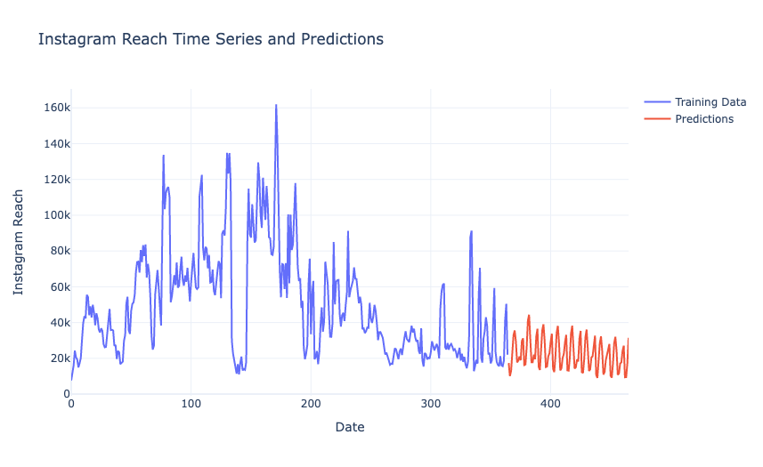
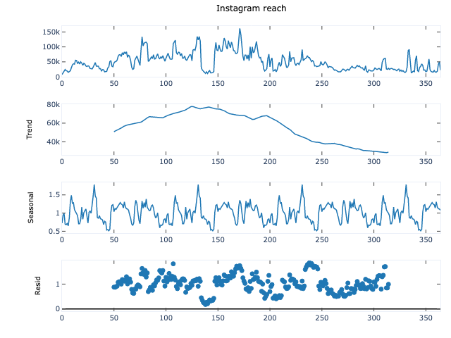

# Instagram Reach Forecasting using Python

This project uses time series forecasting techniques to predict Instagram reach based on historical performance data. Leveraging the SARIMAX model from the `statsmodels` library, it analyzes trends and seasonality to make accurate forecasts for future reach, helping influencers and marketers make data-driven decisions.

---

## Overview

The project includes:

- Data preprocessing and visualization
- Time series decomposition
- SARIMAX model fitting and forecasting
- Evaluation of model performance
- Future reach predictions with confidence intervals

---

## Technologies Used

- Python
- Pandas
- NumPy
- Matplotlib
- Statsmodels (SARIMAX)

---

## How To Run

1. Clone the repository
```bash
git clone https://github.com/veydantkatyal/instagram-reach-forecasting.git
cd instagram-reach-forecasting
```

2. Install Dependencies
```bash
pip install pandas numpy matplotlib statsmodels
```

3. Run the notebook
```bash
Open `instagram_reach_forecasting.ipynb` in Jupyter Notebook or Google Colab and run all cells.
```
---

## Results
- Fitted a SARIMAX model with parameters `(p=8, d=1, q=2)` and seasonal order `(8, 1, 2, 12)`
- Forecasts future Instagram reach for the next 12 months
- Visualizes predictions with confidence intervals


---

## Future Improvements
- Auto-tune SARIMAX parameters using `auto_arima`
- Add model comparison (ARIMA, Prophet, LSTM)
- Build a web dashboard to display predictions

This project is open-source and available under the [MIT License)](https://github.com/veydantkatyal/instagram-reach-forecasting/blob/main/LICENSE)

